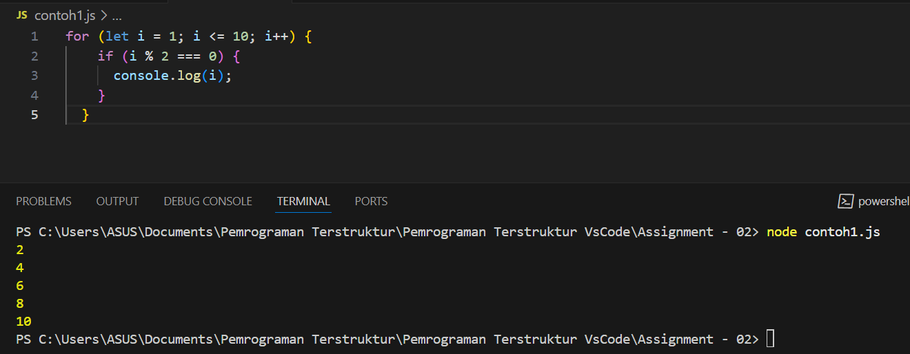
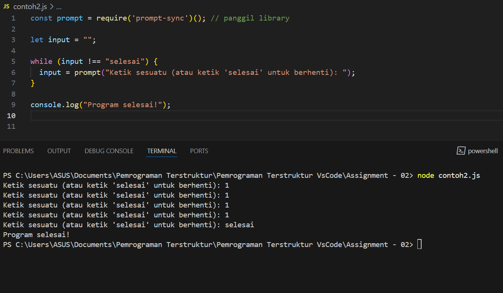
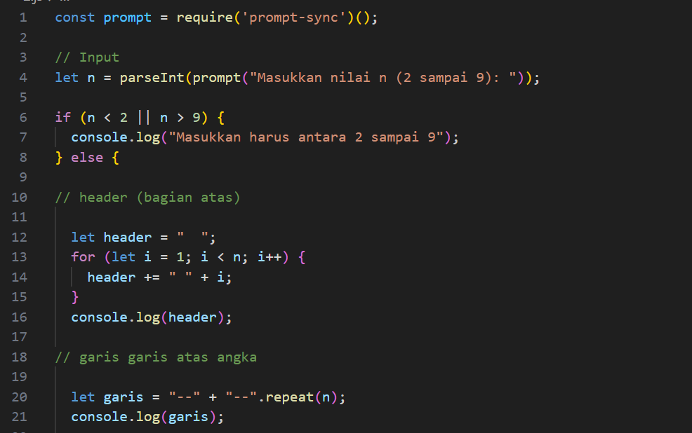
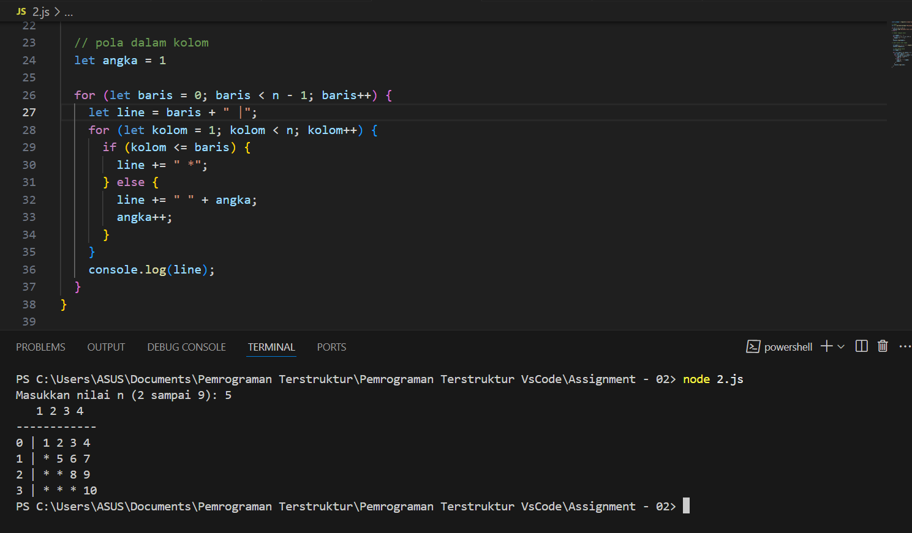
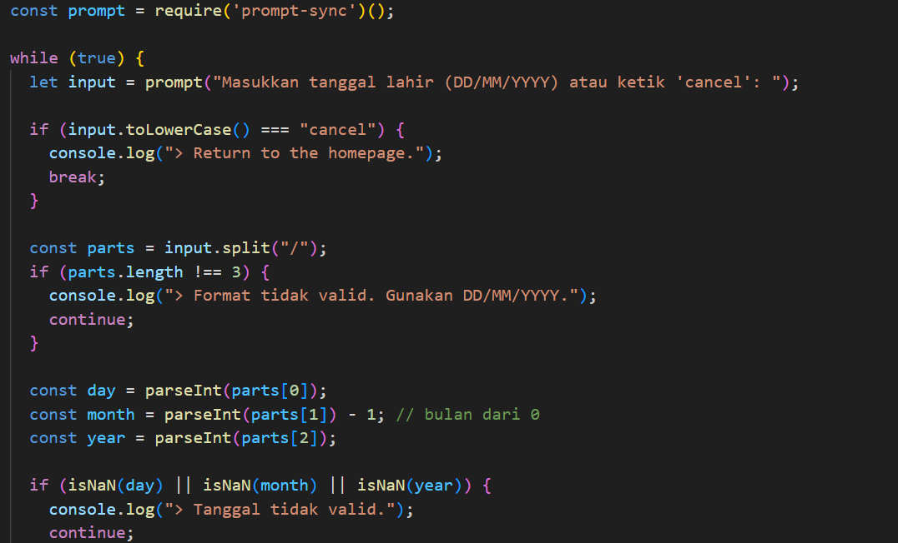
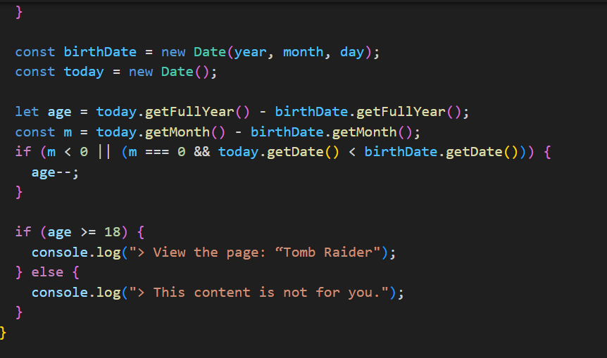
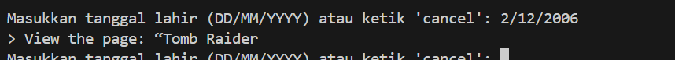
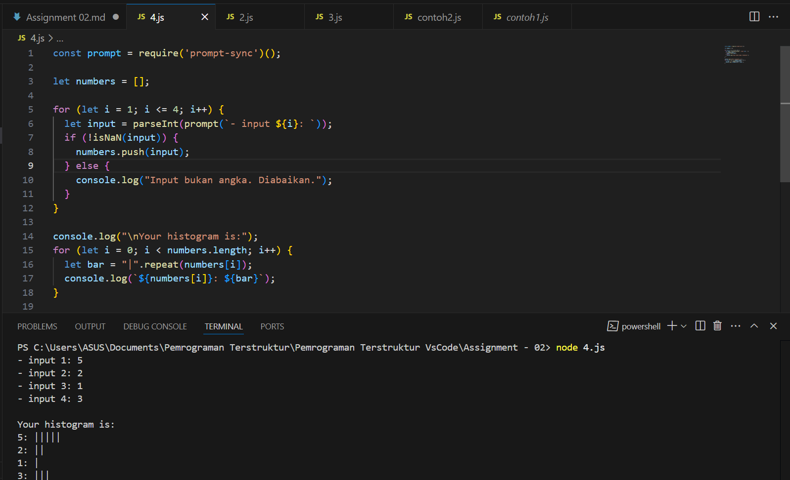
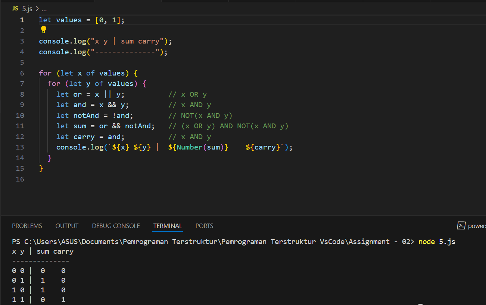

Nama : Indriani Anwar
NIM : 10241036

1. What kind of situation do we need to use for loops or while loops? Explain with a concrete example.
Jawab : Kita menggunakan **for loop** atau **while loop** dalam JavaScript saat kita ingin mengeksekusi suatu blok kode **berulang kali** berdasarkan kondisi tertentu. Misalnya, jika kita ingin mencetak semua angka genap dari 1 sampai 10, kita bisa menggunakan `for loop` karena kita tahu secara pasti berapa kali perulangan akan dilakukan. Contohnya:

Sebaliknya, kita menggunakan `while loop` ketika **jumlah perulangan tidak pasti** dan hanya akan berhenti jika suatu kondisi terpenuhi. Contoh: ketika kita ingin terus meminta input dari pengguna hingga mereka memasukkan kata "selesai".

Jadi, `for loop` cocok untuk perulangan dengan jumlah tetap, sedangkan `while loop` lebih cocok untuk perulangan dengan kondisi dinamis yang tidak diketahui sebelumnya.

2.

3. 

4.

5.

